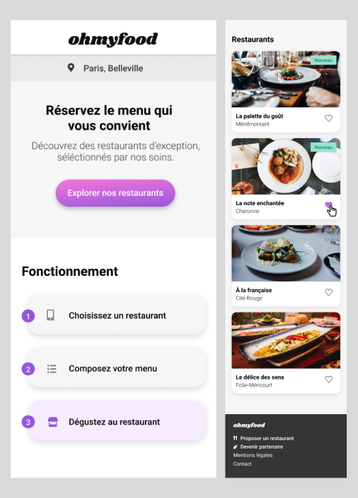

  

<h1>Contexte</h1>

Dans le but de développer mes compétences en HTML/CSS et SASS, j'ai intégré une maquette en site web.

<h1>Contraintes imposées</h1>

<ul>

<li>Intégrer une maquette en site web.</li>
<li>Réaliser un site responsive.</li>
<li>Utiliser des animations SCSS.</li>
<li>Crée un loader</li>
<li>Respecter l'identité graphique.</li>

</ul>

<H1>Technologies utilisées</H1>

